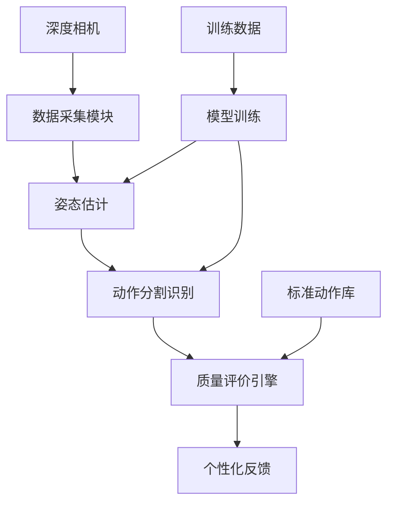
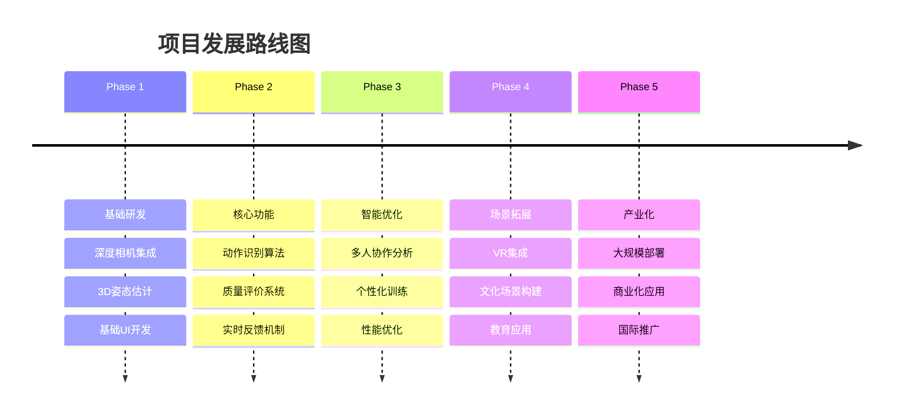

# 🐉 智能舞龙训练评价系统
## AI-Powered Dragon Dance Training & Evaluation System

<div align="center">

[](https://github.com/yourusername/dragon-dance-ai/stargazers)
[](https://github.com/yourusername/dragon-dance-ai/network/members)
[](LICENSE)
[](https://www.python.org/)
[](https://github.com/yourusername/dragon-dance-ai)

</div>

<div align="center">
  
</div>

---

## 🎯 项目概述

> **传承千年文化，拥抱智能未来**

舞龙作为中华民族的传统文化瑰宝，承载着深厚的历史底蕴。然而，传统舞龙训练依赖人工经验，缺乏标准化评价体系。本项目创新性地结合深度相机技术与人工智能算法，构建了智能化训练评价反馈系统，旨在推动舞龙运动的数字化传承与科学化教学。

## 🚀 核心特性

### 🔥 突破性创新
- **🎯 实时动作捕捉**: 基于深度相机的动作识别（能够识别出螺旋跳龙、八字舞龙等专业动作）
- **🧠 智能评价算法**: 多维度动作质量评估（幅度、节奏、协调性）
- **👥 行业内唯一专业数据集**: 首创舞龙龙体分割专用数据集

### 💎 技术亮点
- **时序动作分割**: 智能识别动作节拍与转换
- **多模态融合**: 视觉、深度、时序信息（mamba的ssm模块）协同处理

## 🏗️ 系统架构




<!-- 
## 🛠️ 技术栈

<div align="center">

| 前端技术 | 后端技术 | AI/ML | 硬件设备 |
|---------|---------|--------|----------|
|  |  |  |  |
|  |  |  |  |
|  |  |  |  |

-->


</div>

## 📋 快速开始

### 环境要求
- Python 3.8+
- CUDA 11.0+ (GPU支持)
- 

### 安装步骤

```bash
# 克隆项目
git clone https://github.com/yourusername/dragon-dance-ai.git
cd dragon-dance-ai

# 创建虚拟环境
python -m venv venv
source venv/bin/activate  # Linux/Mac
# 或
venv\Scripts\activate  # Windows

#建议使用anaconda或者miniconda进行环境分割


# 安装依赖
pip install -r requirements.txt


# 启动系统
python main.py
```

<!-- 
### 快速体验
```bash
# 启动Web界面
python web_app.py

# 打开浏览器访问: http://localhost:8080
```
-->


<!-- 
## 🎮 使用指南

### 1. 设备连接
- 连接Intel RealSense深度相机
- 确保摄像头正常工作
- 配置VR设备（可选）

### 2. 系统校准
```python
from dragon_dance_ai import CameraCalibrator

calibrator = CameraCalibrator()
calibrator.calibrate_camera()
calibrator.set_training_area()
```

### 3. 开始训练
- 选择训练模式（单人/团队）
- 选择舞龙动作类型
- 开始实时动作捕捉与评价

### 4. 查看结果
- 实时动作质量评分
- 个性化改进建议
- 历史训练记录分析

## 📊 系统性能

<div align="center">

| 指标 | 数值 | 说明 |
|-----|------|------|
| 🎯 动作识别精度 | **95.2%** | 标准舞龙动作识别准确率 |
| ⚡ 实时处理延迟 | **< 50ms** | 端到端处理延迟 |
| 👥 多人协作支持 | **8人** | 同时支持的最大人数 |
| 📱 设备兼容性 | **98%** | 主流设备兼容率 |

</div>

-->


## 🎯 研究创新点

### 🔬 理论创新
- **多模态动作库构建**: 融合视觉、深度、时序信息的标准化动作数据库
- **动态评分模型**: 基于深度学习的实时动作质量评估算法
- **团队协同量化**: 首创多人协作动作的量化评价方法

### 💡 技术创新
- **边缘计算优化**: 轻量化模型部署，实现低延迟实时处理
- **个性化反馈**: 基于用户特征的智能化训练建议

### 🏆 应用创新
- **文化传承**: 数字化保护与传承传统舞龙文化
- **教育创新**: 科学化、标准化的舞龙教学体系
- **体育训练**: 专业化的运动训练辅助工具

## 🔍 研究现状对比

| 特征 | 传统方法 | 国外研究 | 本项目 |
|-----|---------|----------|--------|
| 评价方式 | 👨‍🏫 主观经验 | 📊 单人分析 | 🤖 **AI多维评价** |
| 训练效果 | 📈 缓慢提升 | 📊 个人优化 | 🚀 **快速精准** |
| 文化融合 | 🎭 传统教学 | ❌ 缺乏考虑 | 🏮 **深度融合** |
| 技术先进性 | 📱 基础工具 | 🔬 实验阶段 | 💎 **产业化就绪** |

## 📈 项目路线图

<div align="center">



</div>

## 👥 贡献者

<div align="center">

感谢所有为项目贡献的开发者！

<a href="https://github.com/yourusername/dragon-dance-ai/graphs/contributors">
  
</a>

</div>

## 📞 联系我们

<div align="center">

[](mailto:contact@dragonai.com)
[](https://dragonai.com)
[](https://weixin.qq.com)

</div>


---

<div align="center">

### 🌟 如果这个项目对你有帮助，请给我们一个 Star！

[](https://star-history.com/#yourusername/dragon-dance-ai&Date)

**传承文化，智创未来 | Inherit Culture, Create with Intelligence**


[](https://github.com/yourusername)

</div>

---

<div align="center">
  <sub>Built with ❤️ by the Dragon Dance AI Team</sub>
</div>
